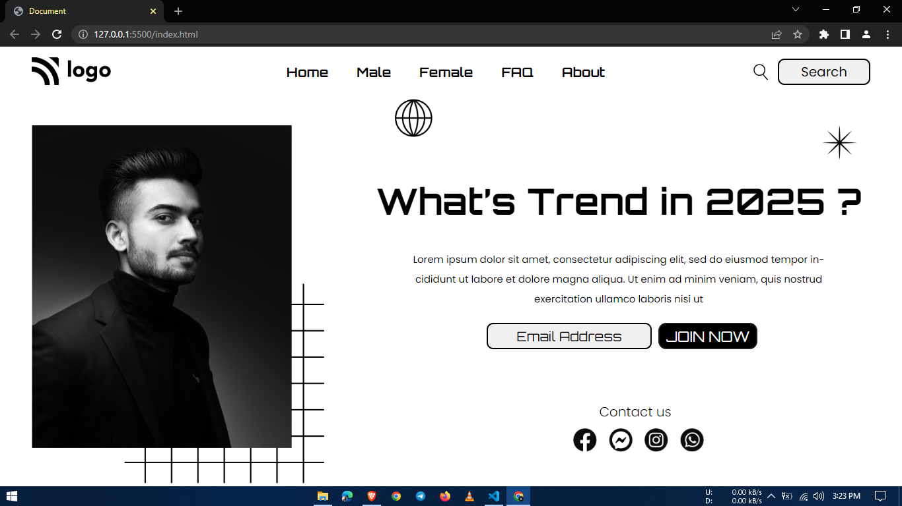

# 1-Trends-landing-page
It is part of the Full Stack Javascript Bootcamp being taught at ineuron.ai by Hitesh Choudhary Sir.

## Project 1 [Live Link]()

-   During this project, I gained the following skills:
    -   I learned how to use CSS position properties (Relative & Absolute).
    -  I learned how to use button animations
    - I learned how to use padding and margins

---

## Time taken to finish this project

-   5 hour to complete it.

#### Screenshot

